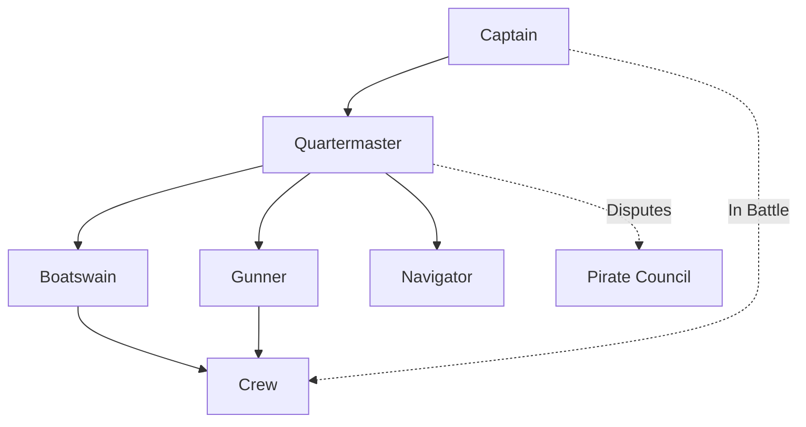

# The Pirate Code ⚓

> *"The Code is more what you'd call guidelines than actual rules."*
> — Captain Barbossa

## Articles of Agreement

Every pirate crew operates under a **strict code** agreed upon before setting sail. These articles cover everything from *loot division* to *conduct in battle*.

### Article I: Loot Division

The distribution of plunder follows a precise formula:

| Rank | Share |
|------|-------|
| Captain | 2 shares |
| Quartermaster | 1.5 shares |
| Navigator | 1.25 shares |
| Gunner | 1.25 shares |
| Surgeon | 1.25 shares |
| Crew | 1 share |

### Article II: Chain of Command

### Article III: Compensation for Injuries

Pirates who suffer injuries in battle receive compensation *before* the general division of loot:

- **Loss of right arm**: 600 pieces of eight
- **Loss of left arm**: 500 pieces of eight
- **Loss of right leg**: 500 pieces of eight
- **Loss of left leg**: 400 pieces of eight
- **Loss of an eye**: 100 pieces of eight
- **Loss of a finger**: 100 pieces of eight

### Article IV: Rules of Conduct

1. Every crew member has a **vote** in affairs of the moment
2. Every crew member has equal title to fresh provisions and strong liquors
3. Lights and candles must be out by `20:00` — drinking after hours must be done on the **open deck**
4. Each man shall keep his piece, cutlass, and pistols at all times *clean and ready for action*
5. No person to game at cards or dice for money
6. ~~Pets are not allowed on board~~ *(Amended: parrots are acceptable)*

### Article V: Desertion

Any pirate who deserts the ship or their quarters in battle shall be punished by:

- [x] Marooning on a deserted island
- [x] Given one pistol with a single shot
- [x] One bottle of water
- [ ] A map to the nearest port *(denied)*

---

*Signed in blood at Nassau, Year of Our Lord 1716*