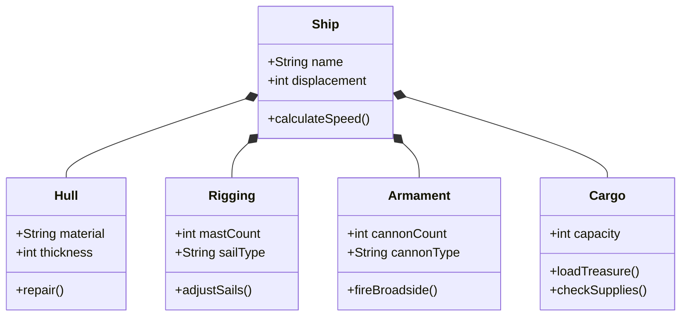

# Anatomy of a Pirate Ship

## Ship Classification

A typical pirate vessel was a modified **frigate** or **brigantine**, optimized for speed and combat. The ideal pirate ship balanced three critical factors:

$$
\text{Effectiveness} = \frac{\text{Speed} \times \text{Firepower}}{\text{Crew Required}}
$$

## Ship Structure

## Ship Specifications

| Component | Brigantine | Frigate | Galleon |
|-----------|-----------|---------|---------|
| Length | 24m | 40m | 50m |
| Beam | 7m | 10m | 15m |
| Draft | 2.5m | 4m | 6m |
| Masts | 2 | 3 | 3–4 |
| Cannons | 12 | 28 | 40+ |
| Crew | 80 | 200 | 300 |
| Speed | 11 knots | 10 knots | 8 knots |

## Cannon Mathematics

The effective range of a cannon depends on elevation angle $\theta$ and powder charge $v_0$:

$$
R = \frac{v_0^2 \sin(2\theta)}{g}
$$

Where:
- $R$ = range in meters
- $v_0$ = muzzle velocity ($\approx 450$ m/s for a 12-pounder)
- $\theta$ = elevation angle
- $g$ = gravitational acceleration ($9.81$ m/s²)

At optimal angle ($\theta = 45°$):

$$
R_{max} = \frac{v_0^2}{g} = \frac{450^2}{9.81} \approx 20,642 \text{ meters}
$$

> **Note:** Actual effective combat range was much shorter (~300m) due to accuracy, wind, and sea conditions.

## Deck Layout

From bow to stern, a pirate ship featured:

1. **Bowsprit** — Forward-pointing spar for headsails
2. **Forecastle** — Raised deck at the bow; crew quarters
3. **Main Deck** — Primary cannon positions and working area
4. **Quarterdeck** — Raised stern deck; captain's command post
5. **Poop Deck** — Highest deck at the stern; navigation
6. **Below Decks**:
   - *Orlop Deck* — Storage and surgeon's quarters
   - *Hold* — Cargo, provisions, and treasure

---

*"A ship is safe in harbor, but that's not what ships are for."*